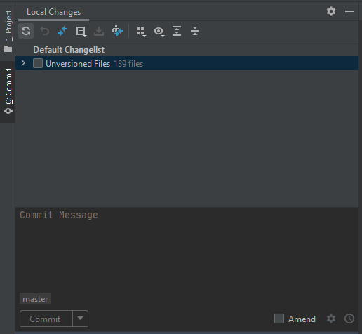
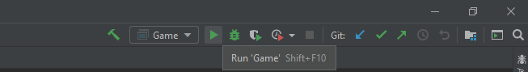

## SinGame
A top down game made in Java

Influenced by various SNES-era games like Zelda, Final Fantasy, and more modern games like Pokemon 

## Setting up the Project
Since this project was made using Java, we reccomend you install Java if you have not already. Other than that, IntelliJ should set up the rest for you after you create a project through cloning our repository.

We used JetBrain's IntelliJ IDEA to make this Project

Through IntelliJ, create a new project from this repository and the project should compile and execute properly when you attempt to run it.

## Editing the Maps 

If you want to create new maps or edit the current ones, open the JSON file you want to edit or create a new JSON file within the program Tiled. Then, create a .tsx file within tiled that corresponds to the tileset that you want to use. Finally, if you want to add teleporters within the map, you have to create an extra bit of data within the JSON file manually with the following formatting:

```
"teleporters":[
  {
   "useTiles": ,
   "x": ,
   "y": ,
   "xTo": ,
   "yTo": ,
   "width": ,
   "height": ,
   "map": "",
   "tileset":""
  }],
  ```
## Editing the Code 

If you want to add changes to the code of our game and you are using an IntelliJ project like we have been, it is extremely simple to do so. In the picture below, you will seen the version control ability built into IntelliJ. Pick whichever files you have changed or created and write a commit message, then you can commit and push from that tab. 



## Running the game

Since the program is written in Java without any dependencies, the program should theoretically be able to run on any platform that has Java installed. This includes Windows, MacOS, and Linux. You run it with the green "run" arrow pictured below.


